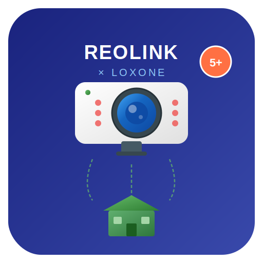

<p align="center">
  
</p>

<h1 align="center">ioBroker.reolink-loxone</h1>

<p align="center">
  <strong>Full Reolink camera integration for ioBroker with direct Loxone Miniserver bridge</strong>
</p>

<p align="center">
  <a href="https://www.npmjs.com/package/iobroker.reolink-loxone"></a>
  <a href="https://www.npmjs.com/package/iobroker.reolink-loxone"></a>
  
  <a href="https://github.com/piotrkalbarczyk/ioBroker.reolink-loxone/blob/main/LICENSE"></a>
</p>

---

## Overview

**ioBroker.reolink-loxone** is a comprehensive ioBroker adapter that provides full API integration with Reolink IP cameras and a built-in bridge to Loxone Miniserver. It enables you to monitor, control, and automate your Reolink cameras directly from ioBroker, with real-time event forwarding to Loxone via HTTP Virtual Inputs or UDP.

### Key Features

- **Multi-camera support** — configure and manage 5, 10, 20+ cameras simultaneously
- **Full Reolink HTTP API** — device info, video streams (RTSP/RTMP/FLV), snapshots, motion detection, AI detection (person/vehicle/animal/face), PTZ control, IR/white LED, audio, recording, image settings, and more
- **Loxone bridge** — forward motion/AI/status events directly to Loxone Miniserver via HTTP Virtual Inputs or UDP, no additional adapters needed
- **ioBroker state tree** — all camera data exposed as ioBroker states for use with scripts, VIS, Grafana, etc.
- **Universal compatibility** — works with all Reolink cameras that expose the HTTP API (RLC-8xx, RLC-5xx, RLC-4xx, E1 series, Argus series, Duo, TrackMix, NVR channels, and more)
- **Auto-reconnect** — automatic session renewal and reconnection on network issues
- **Snapshot capture** — on-demand or automatic (on motion detection) snapshot saving with configurable retention

---

## Supported Cameras

This adapter works with any Reolink camera or NVR that exposes the HTTP API, including but not limited to:

| Series | Examples |
|--------|----------|
| **PoE Bullet/Dome** | RLC-810A, RLC-820A, RLC-811A, RLC-1212A, RLC-510A, RLC-520A, RLC-410, RLC-423 |
| **PoE PTZ** | RLC-823A, RLC-823S, E1 Outdoor PoE |
| **WiFi Indoor** | E1, E1 Zoom, E1 Pro, E1 Outdoor |
| **WiFi Battery** | Argus 3 Pro, Argus PT, Argus Eco |
| **Dual-Lens** | Duo 2, Duo 3, TrackMix PoE, TrackMix WiFi |
| **Doorbell** | Reolink Video Doorbell PoE, WiFi |
| **NVR** | RLN8-410, RLN16-410, RLN36 (each channel as separate camera) |

---

## Installation

### From GitHub (recommended for development)

```bash
cd /opt/iobroker
iobroker url https://github.com/piotrkalbarczyk/ioBroker.reolink-loxone/archive/refs/heads/main.tar.gz
```

### From npm (after publishing)

```bash
cd /opt/iobroker
iobroker add reolink-loxone
```

### Manual installation

```bash
cd /opt/iobroker
npm install iobroker.reolink-loxone
iobroker add reolink-loxone
```

---

## Configuration

### 1. Camera Setup

Open the adapter configuration in ioBroker Admin and navigate to the **Cameras** tab:

| Field | Description |
|-------|-------------|
| **Enabled** | Enable/disable this camera |
| **Camera Name** | Friendly name (used in object tree and Loxone VI names) |
| **IP Address** | Camera IP or hostname |
| **Port** | HTTP port (default: 80, HTTPS: 443) |
| **Username** | Camera login (default: `admin`) |
| **Password** | Camera password |
| **Channel** | Video channel (0 for standalone cameras, 0-15 for NVR) |
| **HTTPS** | Use encrypted connection |
| **Poll Interval** | Status polling interval in seconds (default: 5) |

### 2. Loxone Integration

Navigate to the **Loxone** tab to configure the direct Miniserver bridge:

| Field | Description |
|-------|-------------|
| **Enable** | Activate direct Loxone communication |
| **Miniserver IP** | Loxone Miniserver IP address |
| **HTTP Port** | HTTP port (default: 80) |
| **Username** | Loxone user with API access |
| **Password** | Loxone password |
| **Mode** | `HTTP` (Virtual Inputs), `UDP`, or `Both` |
| **UDP Port** | Target UDP port (default: 7000) |

### 3. Loxone Config Setup

In **Loxone Config**, create Virtual Inputs matching the naming convention:

| Virtual Input Name | Type | Description |
|---|---|---|
| `Reolink_{CameraName}_Motion` | Digital (0/1) | Motion detection state |
| `Reolink_{CameraName}_AI_person` | Digital (0/1) | Person detected (AI) |
| `Reolink_{CameraName}_AI_vehicle` | Digital (0/1) | Vehicle detected (AI) |
| `Reolink_{CameraName}_AI_animal` | Digital (0/1) | Animal detected (AI) |
| `Reolink_{CameraName}_Online` | Digital (0/1) | Camera online status |

> Custom Virtual Input names can be configured per camera in the ioBroker object tree under each camera's `loxone` channel.

---

## Object Tree

Each camera creates the following state structure in ioBroker:

```
reolink-loxone.0.
├── {camera_name}/
│   ├── info/
│   │   ├── connection        (boolean)  Camera connected
│   │   ├── model             (string)   Camera model
│   │   ├── name              (string)   Camera device name
│   │   ├── firmware          (string)   Firmware version
│   │   ├── serial            (string)   Serial number
│   │   ├── hardwareVersion   (string)   Hardware version
│   │   └── channelCount      (number)   Number of channels
│   ├── status/
│   │   ├── motionDetected    (boolean)  Motion detected
│   │   ├── personDetected    (boolean)  Person detected (AI)
│   │   ├── vehicleDetected   (boolean)  Vehicle detected (AI)
│   │   ├── animalDetected    (boolean)  Animal detected (AI)
│   │   ├── faceDetected      (boolean)  Face detected (AI)
│   │   └── lastMotionTime    (number)   Last motion timestamp
│   ├── streams/
│   │   ├── rtspMain          (string)   RTSP main stream URL
│   │   ├── rtspSub           (string)   RTSP sub stream URL
│   │   ├── rtmpMain          (string)   RTMP stream URL
│   │   ├── flvMain           (string)   FLV stream URL
│   │   └── snapshotUrl       (string)   Snapshot URL
│   ├── control/              (writable)
│   │   ├── snapshot          (button)   Capture snapshot
│   │   ├── reboot            (button)   Reboot camera
│   │   ├── irLights          (string)   IR lights: Auto/On/Off
│   │   ├── whiteLed          (boolean)  White LED on/off
│   │   └── siren             (button)   Trigger siren
│   ├── ptz/                  (writable)
│   │   ├── command           (string)   PTZ direction command
│   │   ├── speed             (number)   PTZ speed 1-64
│   │   ├── goToPreset        (number)   Go to preset index
│   │   ├── patrol            (boolean)  Start/stop patrol
│   │   └── stop              (button)   Stop PTZ movement
│   ├── image/                (writable)
│   │   ├── brightness        (number)   0-255
│   │   ├── contrast          (number)   0-255
│   │   ├── saturation        (number)   0-255
│   │   └── sharpness         (number)   0-255
│   ├── snapshot/
│   │   ├── image             (string)   Last snapshot (base64)
│   │   ├── timestamp         (number)   Snapshot timestamp
│   │   └── file              (string)   Snapshot file path
│   ├── storage/
│   │   ├── hddCapacity       (number)   Total capacity (MB)
│   │   └── hddUsed           (number)   Used space (MB)
│   └── loxone/               (writable, if Loxone enabled)
│       ├── motionInputName   (string)   Custom Loxone VI name
│       ├── personInputName   (string)   Custom Loxone VI name
│       ├── vehicleInputName  (string)   Custom Loxone VI name
│       └── onlineInputName   (string)   Custom Loxone VI name
```

---

## API Coverage

The adapter exposes the full Reolink HTTP API v8:

| Category | Commands |
|----------|----------|
| **Authentication** | Login, Logout, token management with auto-renewal |
| **Device Info** | GetDevInfo, GetAbility, GetHddInfo, GetPerformance, Reboot |
| **Network** | GetLocalLink, GetWifi, ScanWifi, GetDdns, GetNtp, SetNtp, GetP2p, GetNetPort, GetUpnp |
| **Video/Encoding** | GetEnc, SetEnc, GetIsp, SetIsp (brightness, contrast, saturation, sharpness) |
| **OSD/Mask** | GetOsd, SetOsd, GetMask |
| **Streams** | RTSP (main/sub/ext), RTMP, FLV URL generation |
| **Snapshots** | Snap command with binary JPEG response |
| **Motion Detection** | GetMdState (polling), GetAlarm, SetAlarm |
| **AI Detection** | GetAiState (person, vehicle, animal, face), GetAiCfg, SetAiCfg |
| **Audio Alarm** | GetAudioAlarmV20, SetAudioAlarmV20, AudioAlarmPlay (siren) |
| **PTZ** | PtzCtrl (Left/Right/Up/Down/Zoom/Focus/Auto/Stop/ToPos), GetPtzPreset, SetPtzPreset, GetPtzPatrol, GetPtzGuard, SetPtzGuard, GetZoomFocus |
| **Recording** | GetRec, SetRec, Search, GetRecV20 |
| **IR/LED** | GetIrLights, SetIrLights, GetWhiteLed, SetWhiteLed |
| **Audio** | GetAudioCfg, SetAudioCfg |
| **Notifications** | GetEmail, SetEmail, TestEmail, GetFtp, SetFtp, TestFtp, GetPush, SetPush |
| **Users** | GetOnline, GetUser |
| **System** | GetTime, SetTime, batch commands |

---

## Usage Examples

### ioBroker JavaScript

```javascript
// React to person detection on front door camera
on('reolink-loxone.0.front_door.status.personDetected', function (obj) {
    if (obj.state.val === true) {
        log('Person detected at front door!');
        // Trigger notification, light, etc.
        setState('hue.0.light_porch.on', true);
    }
});

// Capture snapshot via script
setState('reolink-loxone.0.front_door.control.snapshot', true);

// PTZ: rotate camera to preset 3
setState('reolink-loxone.0.garden_cam.ptz.goToPreset', 3);

// Toggle white LED spotlight
setState('reolink-loxone.0.driveway.control.whiteLed', true);
```

### Loxone Automation

Once Virtual Inputs are configured, you can use them directly in Loxone Config:

1. **Lighting**: Turn on porch light when `Reolink_FrontDoor_AI_person` = 1
2. **Alarm**: Trigger alarm when `Reolink_Garage_Motion` = 1 AND alarm system is armed
3. **Notifications**: Send push when `Reolink_Driveway_AI_vehicle` = 1
4. **Recording**: Activate NVR recording via Virtual Output when motion detected

### VIS Dashboard

Use the `streams.rtspMain` or `streams.snapshotUrl` states in VIS widgets to display live camera feeds or periodically updated snapshots.

---

## Architecture

```
┌──────────────────┐     HTTP API      ┌─────────────────────┐
│  Reolink Camera  │◄─────────────────►│                     │
│  (192.168.1.x)   │    JSON / JPEG    │                     │
├──────────────────┤                   │  ioBroker Adapter   │
│  Reolink Camera  │◄────────────────► │  reolink-loxone     │
│  (192.168.1.y)   │                   │                     │
├──────────────────┤                   │  ┌───────────────┐  │
│  Reolink NVR     │◄────────────────► │  │ ReolinkAPI    │  │
│  (192.168.1.z)   │                   │  │ client        │  │
└──────────────────┘                   │  └───────┬───────┘  │
                                       │          │          │
                                       │  ┌───────▼───────┐  │
                                       │  │ State Manager │  │──► ioBroker Objects
                                       │  └───────┬───────┘  │   (VIS, Scripts,
                                       │          │          │    Grafana, etc.)
                                       │  ┌───────▼───────┐  │
                                       │  │ LoxoneBridge  │  │
                                       │  └───────┬───────┘  │
                                       └──────────┼──────────┘
                                                  │
                                      HTTP/UDP    │
                                                  ▼
                                       ┌──────────────────┐
                                       │ Loxone Miniserver│
                                       │ Virtual Inputs   │
                                       └──────────────────┘
```

---

## Troubleshooting

**Camera not connecting:**
- Verify the camera IP is reachable: `ping 192.168.1.x`
- Ensure the HTTP API is enabled on the camera (it is by default)
- Check username/password — the default is usually `admin`
- Some newer firmware versions require HTTPS; try enabling the HTTPS option

**Motion detection not working:**
- Ensure motion detection is enabled in the camera's own settings (web UI or Reolink app)
- AI detection (person/vehicle/animal) requires cameras with AI capability (models with "A" suffix, e.g., RLC-810A)
- Reduce polling interval for faster response

**Loxone not receiving events:**
- Verify the Miniserver IP is correct and reachable
- Ensure the Loxone user has API access permissions
- Virtual Input names must exactly match the convention (case-sensitive)
- For UDP mode, ensure the port is open and matches the Loxone UDP Monitor configuration

**PTZ not responding:**
- Only PTZ-capable cameras support PTZ commands (e.g., E1 Zoom, RLC-823A)
- Verify the camera model supports PTZ in its specifications

---

## Development

```bash
# Clone the repository
git clone https://github.com/piotrkalbarczyk/ioBroker.reolink-loxone.git
cd ioBroker.reolink-loxone

# Install dependencies
npm install

# Run linting
npm run lint

# Run tests
npm test
```

### Local testing with ioBroker

```bash
# In your ioBroker installation
cd /opt/iobroker
npm install /path/to/ioBroker.reolink-loxone
iobroker add reolink-loxone
```

---

## Contributing

Contributions are welcome! Please open an issue first to discuss what you would like to change.

1. Fork the repository
2. Create your feature branch (`git checkout -b feature/amazing-feature`)
3. Commit your changes (`git commit -m 'Add amazing feature'`)
4. Push to the branch (`git push origin feature/amazing-feature`)
5. Open a Pull Request

---

## License

This project is licensed under the MIT License — see the [LICENSE](LICENSE) file for details.

---

## Acknowledgments

- [Reolink Camera API User Guide V8](https://community.reolink.com/topic/4196/reolink-camera-api-user-guide_v8-updated-in-april-2023) — official API documentation
- [reolink_api_wrapper](https://github.com/mosleyit/reolink_api_wrapper) — OpenAPI 3.0 specification with 110+ endpoints
- [ioBroker Adapter Development](https://iobroker.github.io/dev-docs/getting-started/02-create-adapter/) — official ioBroker dev docs
- [Loxone Miniserver HTTP API](https://www.loxone.com/enen/kb/api/) — Virtual Input documentation

---

<p align="center">
  Made with care for the ioBroker + Loxone + Reolink community
</p>
